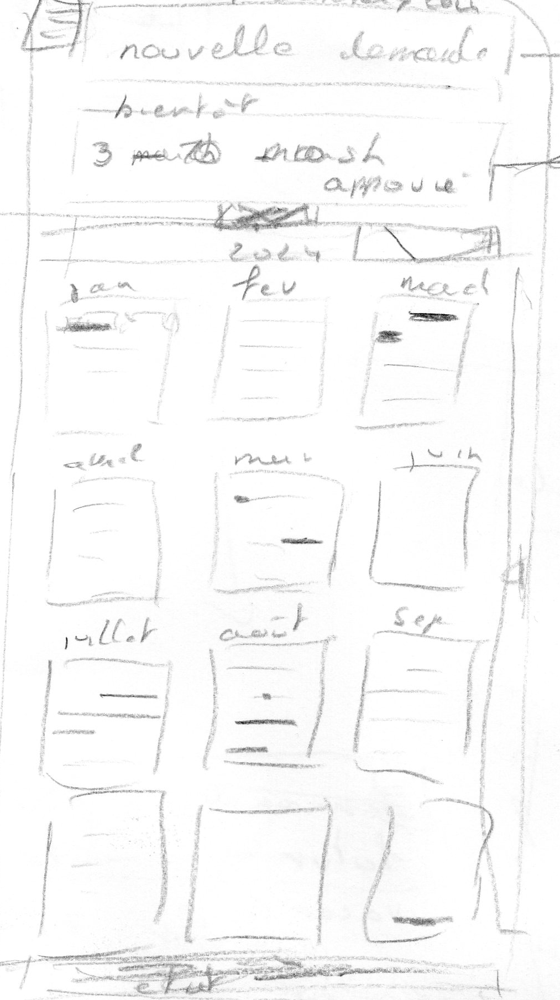

[<< écrans](./2-2-ecrans.md)

### écran d'acceuil ###

L'écran d'acceuil est l'écran affiché au démarrage de l'application (landing page).

Du haut vers le bas:
- le menu, voir [menu](./2-2-c-1-menu.md)
- le boutton "nouvelle demande" qui ouvre la page [demande de congé](./2-2-2-demande-de-conge.md)
- le panneau "prochainement" avec la liste des prochains congés, avec défilement tactile si nécessaire
    - "3-10 mars - approuvé" est le prochain congé et son statut, un click ouvre la page détail d'un congé
    - "25 juillet - 10 août - attente approbation", le congé suivant
- le calendrier annuel sous la forme de 12 mois. Les jours de congé sont marqués avec une couleur de fond:
    - vert pour les congés approuvés
    - orange pour les congés à l'approbation
    - rouge pour les congés refusé
    - bleu pour les congé pris
    - un click sur une date ouvre:
        - le congé si un congé existe pour cette date
        - une demande de congé avec la date de début initialisée avec la date choisie
- le solde des congés, avec défilement tactile si nécessaire. Un click ouvre la page [solde](./2-2-3-solde.md)

[>> demande de congé](./2-2-2-demande-de-conge.md)