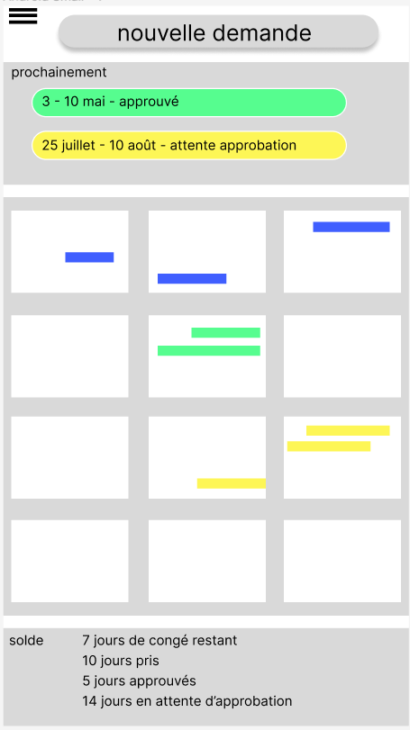

[<< écrans](./2-2-ecrans.md)

### écran d'acceuil ###

L'écran d'acceuil est l'écran affiché au démarrage de l'application (landing page).

Du haut vers le bas:
- le menu, voir [menu](./2-2-c-1-menu.md)
- "24 février 2023" est la date courante (invisible sur le scan ...)
- "3-10 mars / approuvé" est le prochain congé et son statut
- "2023" permet de changer l'année
- le calendrier annuel sous la forme de 12 mois. Les jours de congé sont marqués avec une couleur de fond:
    - vert pour les congés approuvés
    - orange pour les congés à l'approbation
    - rouge pour les congés refusé
    - bleu pour les congé passés

[>> demande de congé](./2-2-2-demande-de-conge.md)