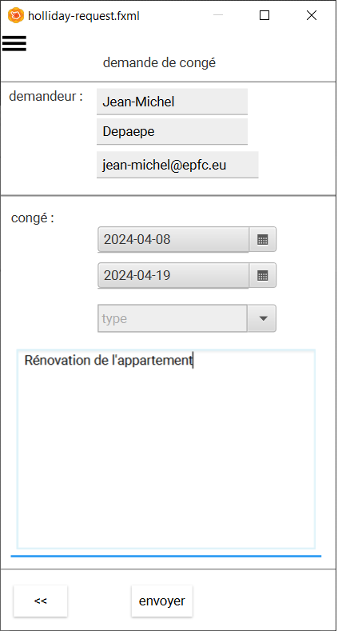

[<< accueil](./2-2-1-accueil.md)

### écran de demande de congé ###
Il s'agit du formulaire de demande de congé.

Le nom et prénom de l'utilisateur sont automatiquement remplis et il n'est pas possible de les modifier.

Le premier input permet de remplir la date de début de congé. Nous utilisons un composant avec une zone de saisie et un bouton pour ouvrir un calendrier ([voir par exemple le calendar de primeng](https://primeng.org/calendar#icon)).

Le second input permet de remplir la date de fin de congé. Il est semblable au premier.

Suit un composant de type Dropdown qui liste l'ensemble des types de congés de l'entreprise ([voir par exemple le DropDown de primeng](https://primeng.org/dropdown#editable)).

TODO: lister les différents type de congés.

Il y a ensuite une zone de texte libre pour que l'utilisateur puisse indiquer un commentaire.

En bas d'écran, à droite se trouve un bouton de navigation pour revenir en arrière (et donc annuler) et un bouton au centre pour envoyer la demande de congé à l'approbation.

Lorsque l'utilisateur clique sur le bouton "envoyer", la demande de congé est enregistrée, une notification est envoyée au manager de l'employé et une confirmation est envoyée à l'employé.
