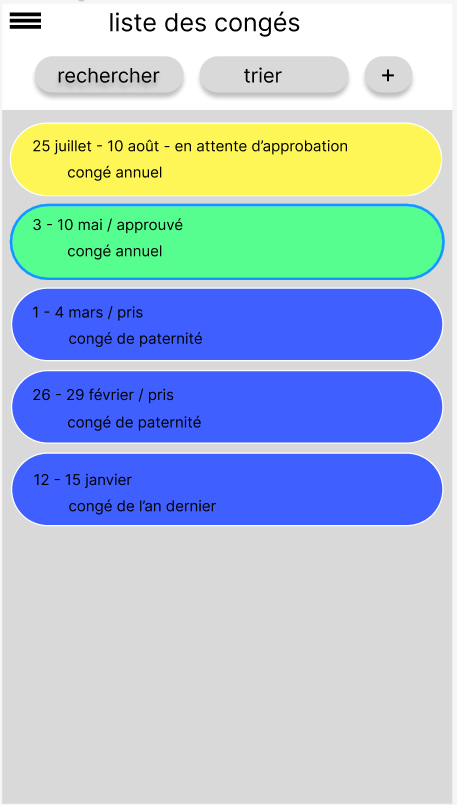

### Ecran liste des congés

Cet écran affiche ... la liste des congés:

Du haut en bas:
- le [menu](./2-2-c-1-menu.md) au format hamburger
- le titre "lise des congés"
- les bouttons:
  - rechercher qui ouvre un popup permettant la recherche sur:
    - date de début
    - date de fin
    - statut
    - type de congé
    - un mot libre (recherche dans toutes les données)
  - trier qui ouvre un popup permettant de trier sur
    - date de début
    - statut
    - type de congé
  - nouveau congé (+) qui ouvre la page [demande de congé](./2-2-2-demande-de-conge.md)
- le panneau contenant les tuiles "congés". Chaque tuile contient:
  - les dates de début et de fin
  - le statut
  - le type de congé
  - un click sur la tuile ouvre la page détail du congé
  - le panneau permet le défilement manuel

  Les dates sont affichées avec intélligence:
  - les mois ne sont pas répétés, par exemple: 3 - 10 mai et pas 3 mai - 10 mai
  - l'année n'est affichée que si l'année est différente de l'année en cours, par exemple (imaginant que nous sommes en 2024):
    - 24 décembre - 7 janvier 2025
    - 14 - 28 février 2025
