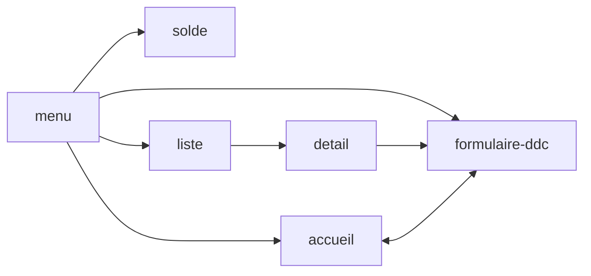

[<<< analyse fonctionnelle](./2-analyse-fonctionnelle.md)

# Analyse fonctionnelle - description des écrans #

Cette section est dédicacée à la description des écrans de ddc-app.

## Liste des écrans de l'employé ##
1. [accueil](./2-2-1-accueil.md) : parge d'accueil, calendrier des congés
1. [demande de congé](./2-2-2-demande-de-conge.md) : un formulaire de demande de congé
1. [solde](./2-2-3-solde.md) : solde des congés
1. liste : liste des congés
1. détail : détail d'un congé
1. ...?

avec la navigation suivante:

Notons que:
- le menu est un composant présent sur tous les écrans
- chaque écran un boutton "back" pour revenir à l'écran précédent

## Liste des écrans du manager
1. demande de congé en attente d'approbation
1. calendrier des congés des collaborateurs
1. formulaire d'approbation
1. ... ?

## Liste des écrand du rh
1. la liste des demandes de congé en attente d'approbation
1. formulaire d'approbation
1. formulaire de demande de congé pour un travailleur
1. liste des congés d'un travailleur
1. ... ?

## Autres cas
Un utilisateur peut cumuler plusieur rôles. Il peut être employé, manager et rh. Dans ce cas, l'application ajoute un élément de menu "sélectionner un rôle" qui contient au plus:
- employé
- manager
- rh

[>> écran d'accueil](./2-2-1-accueil.md)