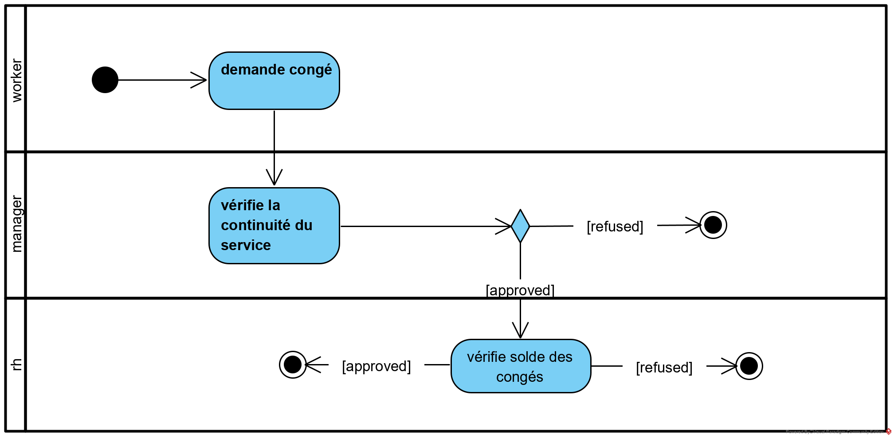

[<< introduction](./1-introduction.md)
# Analyse fonctionnelle #

Nous décrivons ici les fonctions de l'application ddc-app.

L'analyse sera divisée différentes parties:
1. [la description des utilisateurs de l'application](./2-1-utilisateurs.md)
1. [la description des écrans de l'application](./2-2-ecrans.md)
1. la description des règles métiers

## Processus ##
Le processus de demande de congé est :

*Diagramme UML d'activité utilisé pour décrire le processus de demande de congé.*

Dans le premier couloir, nous voyons que le **worker** effectue une demande de congé. 

Ensuite, son **manager** vérifie que son service peut continuer à fonctionner sans le **worker** et approuve ou refuse la demande de congé. Notons qu'une notification est envoyée tant au **worker** qu'à son **manager**.

En cas d'approbation, le membre du **rh** vérifie que le congé n'enfreind pas les règles de l'entreprise, donc essentiellement, il vérifie le solde des congés. Sur cette base, il approuve la demande ou la refuse. Notons qu'une notification est envoyée tant au **worker** qu'à son **manager**.

[>> utilisateurs](./2-1-utilisateurs.md)

[>> glossaire](./3-glossaire.md)