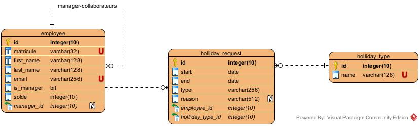

# database #
Le modèle de database décrit le schéma de la base de données utilisée pour l'application.

La table **employee** contient la liste des employés. Le flag **is_manager** indique si l'employé est un manager.

Nous avons une relation **0,1---n** entre employés car:
- un employé a un manager (ou aucun dans le cas du patron);
- un manager (qui est un employé) a zéro, un ou plusieurs collaborateurs (qui sont des employés).

La table **holliday_type** contient la liste des types de congés:
- congé annuel
- congé de maternité
- congé de naissance
- congé d'aidant
- congé parental
- congé parental d'accueil
- congé d'adoption
- congé d'accueil
- congé assitance soin
- congé d'aidant proche
- congé-éducation payé
- congé politique
- crédit-temps
- vacances jeunes
- vacances seniors
- don de congés conventionnels

La table **holliday_request** contient les demandes de congés.

La relation **employee 1---n holliday_request** car:
- un employee peut avoir plusieur demande de congés,
- une demande de congé est faite par un employé.

La relation **holliday_request n--1 holliday_type** car:
- une demande de congé a un type
- un type peut caractériser de nombre de congé

