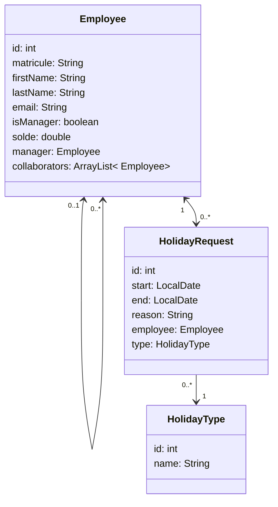

# Entités

Les entités de la demande de congés sont:

### Employee
La classe Employee représente un ... employé. Ses attributs sont:
- id : l'identifiant technique permettant de retrouver l'employé dans la DB
- matricule : l'identifiant métier de l'employé, il doit être unique
- firstName: prénom
- lastName : nom de famille
- email, il doit être unique
- isManager est un booléen qui indique si l'employé est un manager
- solde est le solde de jour de conges (nous savons que cette implémentation est approximative et doit être modifée)
- manager est une référence vers le manager de l'employé. Il est null pour un employé sans manager, soit, en principe, le patron
- collaborators est la liste d'employés dont l'employé est le manager. Cette liste devra être vide si l'employé n'est pas un manager.

### HolidayRequest
La classe HolidayRequest représente une demande de congé:
- id est l'identifiant en base de données
- start est la date de début du congé. start doit être aujourd'hui ou dans le futur
- end est la date de fin du congé. end doit être plus grand ou égal à start
- reason est une raison du congé. Cette attribut n'est pas obligatoire
- employee est une référence vers l'employé qui a fait la demande
- type est une référence vers le type de congé

### HolidayType
La classe HolidayType représente un type de demande de congé :
- id est l'identifiant en DB
- name est le nom du type de congé, il doit être unique.

Il s'agit essentiellement d'une liste de type de congés qui ne change que très rarement (voir [modèle de DB](./4-database.md) pour plus d'information).

